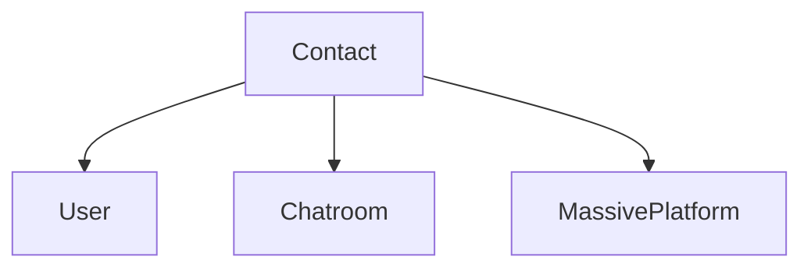

VChat对联系人和消息内容做了建模，结合type hint你可以方便的知道VChat提供的所有功能

# 联系人(Contact)

联系人是群聊，好友，公众号的抽象，联系人有一个重要的属性`username`  
`username`的格式类似`@njdai2312bf0912hasdxxxx`和`@@q9jddhd0qjfjxxx`，它相当于一个联系人的**临时**ID，  
发送消息时，需要指定发送给的联系人的`username`，接受消息时，能获取给你发消息的联系人的`username`  
当获得一个联系人对象后，需要判断它是好友还是群聊还是公众号，VChat已经完成了类型匹配， 只需要通过`isinstance`
判断它属于哪一个类，就能知道给你发消息的是谁。  
此外，联系人还有一个属性`nickname`，它是显示在微信客户端中的昵称  
注意，同一个联系人的`username`在每次登录（非热重载）后都会改变，热重载功能保存了登录使用的cookie，但有效时间只有3-4小时，cookie过期之前，使用
热重载登录微信，联系人的`username`不变，cookie过期后所有联系人的`username`都发生改变  
如果需要在两次登录之间唯一标识一个联系人，请使用`Uin`

> 注意：微信网页端已经严格限制了Uin的获取，过去可以通过Uin唯一标识一个用户，现在只能获取自己的Uin，其他用户的Uin字段为`"0"`

Contact类继承自Mapping，所以所有Contact对象都是不可变的，因为VChat在内部会复用这些对象  
Contact对象会随着接收微信服务器消息而自动创建，如果用户的头像或者昵称发生改变，VChat在下次消息中返回的Contact对象也会更新

如果你需要访问Contact类的更多属性，请通过`contact['xxx']`下标访问，Contact类的完整属性见xxx  
如果你认为某个属性很重要，应该提供类型安全而且更方便的访问方式，可以在issue中提出或者pull request

# 消息(Message)

Message是一个很有用的类，它有五个属性

| 属性名             | 类型          | 说明                                    |
|-----------------|-------------|---------------------------------------|
| form_           | Contact     | 表示发送消息的联系人                            |
| to              | Contact     | 表示消息发给的联系人                            |
| content         | Content     | 表示这个消息携带的内容                           |
| message_id      | str         | 表示这个消息的id，用于提供撤回功能                    |
| chatroom_sender | User\| None | 如果这个消息是群聊的消息，这个属性将被设置为发送消息的群员，否则为None |

# 内容(Content)

Content是所有类型的内容的抽象类，VChat提供了多种内容以支持接收多种内容的需求

- TextContent(文本)

| 属性名      | 类型   | 说明       |
|----------|------|----------|
| content  | str  | 文本内容     |
| is_at_me | bool | 文本中是否@自己 |

- ImageContent(图片)

| 属性名         | 类型                                | 说明           |
|-------------|-----------------------------------|--------------|
| download_fn | `Callable[..., Awaitable]` (协程函数) | 调用协程函数即可下载图片 |

- VideoContent(视频)

| 属性名         | 类型                                | 说明           |
|-------------|-----------------------------------|--------------|
| download_fn | `Callable[..., Awaitable]` (协程函数) | 调用协程函数即可下载视频 |

- VoiceContent(音频)

| 属性名         | 类型                                | 说明           |
|-------------|-----------------------------------|--------------|
| download_fn | `Callable[..., Awaitable]` (协程函数) | 调用协程函数即可下载音频 |

- AttachContent(文件)

| 属性名         | 类型                                | 说明           |
|-------------|-----------------------------------|--------------|
| download_fn | `Callable[..., Awaitable]` (协程函数) | 调用协程函数即可下载文件 |

- RevokeContent(撤回消息)

| 属性名                | 类型  | 说明       |
|--------------------|-----|----------|
| revoked_message_id | str | 撤回的消息的id |
